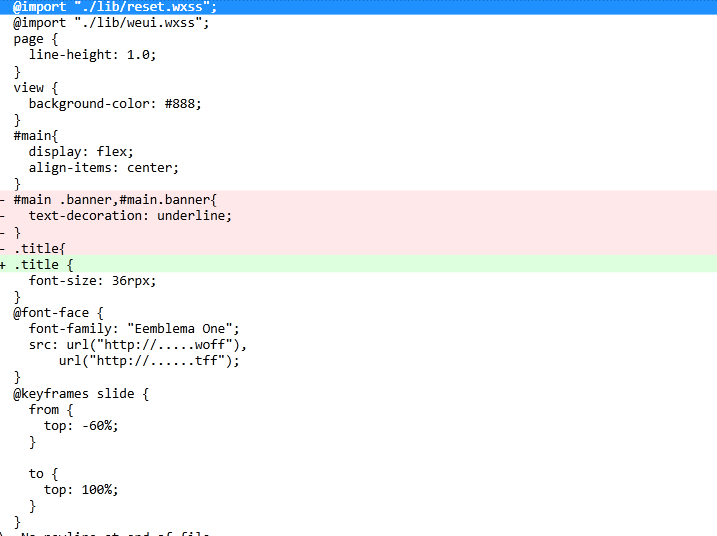

> peel-unused-css-in-wx-miniprogram 是一款用来清除app.wxss中未使用的class的样式的cli工具。使用它你可以清除掉app.wxss中以及在app.wxss中@import的未使用的class样式。从而减少冗余的文件体积。

## 如何使用
```bash
npm install -g peel-unused-css-in-miniprogram
peel-wx 
```

## 哪些样式不会被清除
* @import,@font-face,@keyframes等规则不会被移除
* 选择器是标签名如(page,view),或者是id选择器的样式都不会被处理，也就不会移除。(使用id选择器是不被推崇的，所以这里就不考虑处理了)
* 组件的wxml不考虑，因为app.wxss的样式不会作用到组件中。

假设我们的page中只是用了.title class.那么app.wxss的前后对比如下


## 关于wanring
对于wxml中的class 名字的提取不是基于运行时DOM树的，只是简单的字符解析。所以对于一些运行时的class是没有办法检测到的
```html
<view class="red {{ ...list }}"></view>
<view class="{{ show ? 'active' : notActive }}"></view>
```

如上面的模板文件，工具能够识别的class为red和active两个class，而list,notActive所在的class名称是无法识别的。比如说如果notActive = 'not-active'，而这个.not-active的样式是写在app.wxss中的，那么工具会移除掉这个.not-active.这可能会造成一定的错误，但是有个补救的措施，就是可以根据warning来确认是否移除是正确的。